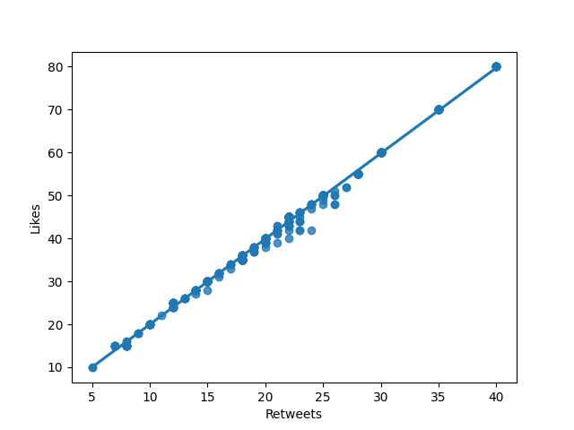
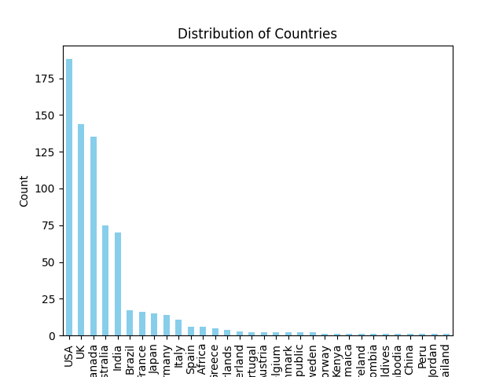
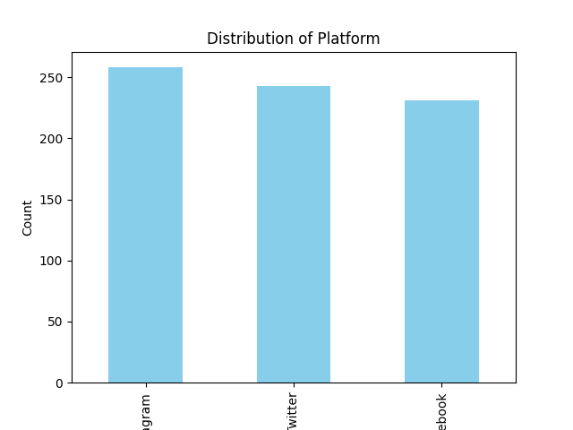
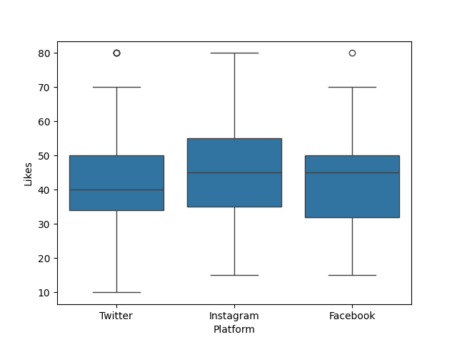
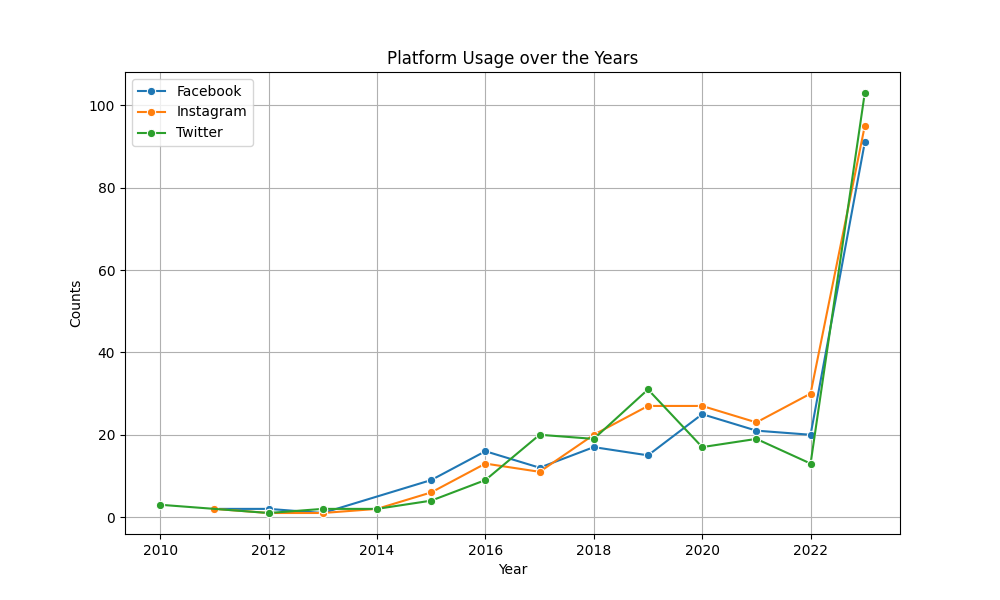
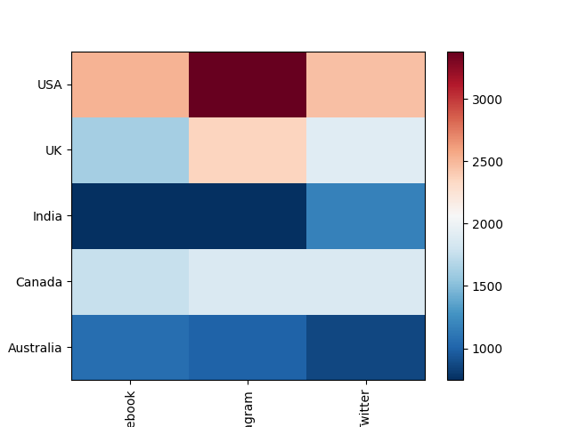

**Introduction**

The dataset, titled 'Social Media Sentiments Analysis Dataset,' offers a rich tapestry of human emotions, trends, and interactions as observed across diverse social media platforms. It serves as a snapshot of user-generated content, encapsulating a myriad of elements including textual narratives, timestamps, hashtags, geographic locations, likes, and retweets. By extracting this dataset from www.kaggle.com, we gain access to a wealth of information that sets the stage for comprehensive analysis and insights into the dynamics of social media discourse.

**Likes and Retweets**

The top twenty posts for 'Likes' and 'Retweets' are the same in both cases. The Pearson Correlation Coefficient is over 0.99, meaning there is a strong linear relationship between the two. Additionally, the presence of many different hashtags and sentiment descriptors makes analysis challenging here. Text variables that are more discrete are 'Platform' and 'Country.' Therefore, I will next examine these.

**Countries and Platforms**

From this, we can see that although many countries have entries, the majority (over two-thirds) comes from the top 5. This may be because the platforms from which we have extracted data are prosperous in these countries and not in others. For example, China has a very small presence here.

Several key insights from the data analysis:

**Similar Number of Entries Across Platforms**: The distribution of entries across platforms is relatively consistent, indicating a comparable level of activity on each platform.

**Instagram Receives More Likes**: The box plot reveals that Instagram posts tend to receive more likes compared to other platforms. Specifically, the top 25% of Instagram posts receive between 55 to 80 likes.

**Twitter is Most Popular Over the Years**: Despite Instagram receiving more likes per post, the analysis of platform usage over the years shows that Twitter is currently the most popular platform.

**Similar Profile Across Platforms**: Despite differences in popularity and engagement metrics, all three platforms exhibit a similar profile, suggesting that users may engage with content similarly across different platforms.

These insights provide valuable information about user behavior and platform dynamics, which can inform strategic decisions related to content creation, platform selection, and audience engagement strategies.

**Final Conclusions:**

- The top five countries for using 'Instagram,' 'Twitter,' and 'Facebook' are the USA, UK, Australia, Canada, and India.
- There is an incredibly strong linear relationship between 'Likes' and 'Retweets.'
- Usage over the years has been very similar across the platforms.
- The USA favors 'Instagram,' while Canada shows no clear preference.
